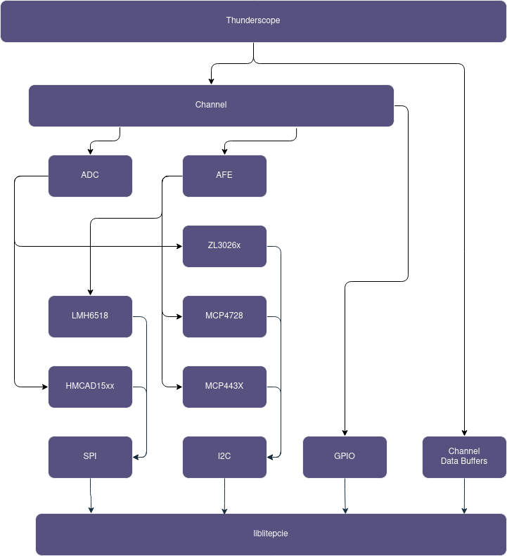

# Thunderscope Library

This repository provides a library for the LiteX Thunderscope gateware.  It is built upon the litepcie driver and includes the register definition files from the Thunderscope gateware build.  The Thunderscope litepcie driver should be built separately.



## Requirements

For the Windows build, requires:
- VS 2022
- Cmake

## Build

```cmd
> cd build
> cmake ..
> cmake --build .
```
Output binaries are in the `build/artifacts` folder.

## Bindings

### Python

To build the python bindings, you must first have pipx and cython installed. The easiest way to set this up is in a virtual env.

```bash
> python -m venv .venv
> source .venv/bin/activate
> pip install -r requirements.txt
```

Now you can build the `PyBindings` target with cmake

```bash
> cd build/
> cmake --build . -t PyBindings
```

The wheel is built to the `build/bindings/python/dist` folder and can be installed with pip.
